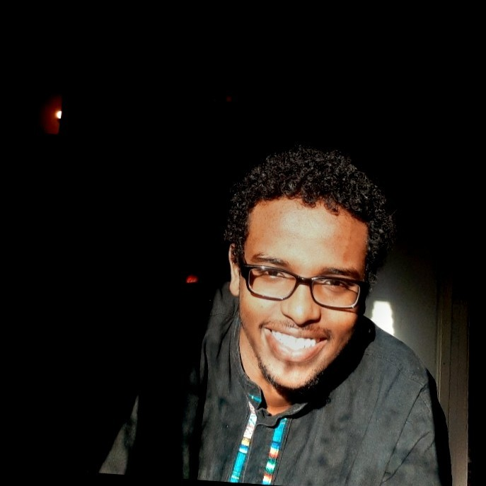
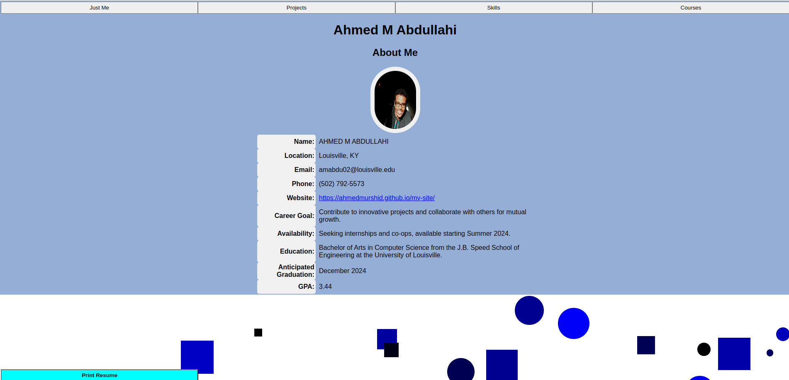

---
Ahmed M Abdullahi's Portfolio
---

# Hi, I'm AHMED M ABDULLAHI 👋

_Location_: Louisville, KY | [LinkedIn Profile](https://www.linkedin.com/in/ahmed001a/)

  

    <h2 style="text-align: center;">📊 My GitHub Stats</h2>
    
  

  

    <h2 style="text-align: center;">💻 Most Used Languages</h2>
    
  

## Education 🎓

- **Degree**: Bachelor of Art in Computer Science
- **School**: J.B. Speed School of Engineering, University of Louisville
- **Anticipated Graduation**: December 2024

# Portfolio Overview - Ahmed M Abdullahi

## Contact

For professional inquiries or to discuss potential opportunities, please reach out via:

- Email: `amabdul02@louisville.edu`
- Phone: `(502) 792-5573`

For a more detailed look, visit my [personal website](https://ahmedmurshid.github.io/my-site/).

Thank you for exploring my portfolio!
