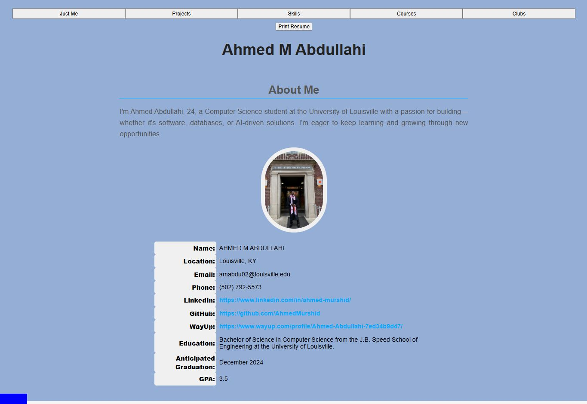

# Hi, I'm AHMED M ABDULLAHI 👋

📍 **Location**: Louisville, KY  
🔗 [LinkedIn](https://www.linkedin.com/in/ahmed001a/) | [GitHub](https://github.com/AhmedMurshid) | [WayUp Profile](https://www.wayup.com/profile/Ahmed-Abdullahi-7ed34b9d47/)

🎯 **Pitch**: CS grad passionate about building data-driven tools—automated pipelines, ML models, and dashboards that make insights actionable.

---

## 💼 Portfolio Overview

Projects include:
- Rocket launch delay prediction using AutoML on AWS
- Oracle database automation at UPS
- Health data dashboard with Python & visualization tools
- Interactive Android and web-based apps

---

## 🎓 Education

- **Degree**: Bachelor of Science in Computer Science
- **School**: J.B. Speed School of Engineering, University of Louisville
- **Graduation**: December 2024
- **GPA**: 3.5

---

## 📬 Contact

For professional inquiries or collaboration opportunities:

- 📧 Email: `amabdul02@louisville.edu`
- 📞 Phone: `(502) 792-5573`

Thanks for exploring my work!
